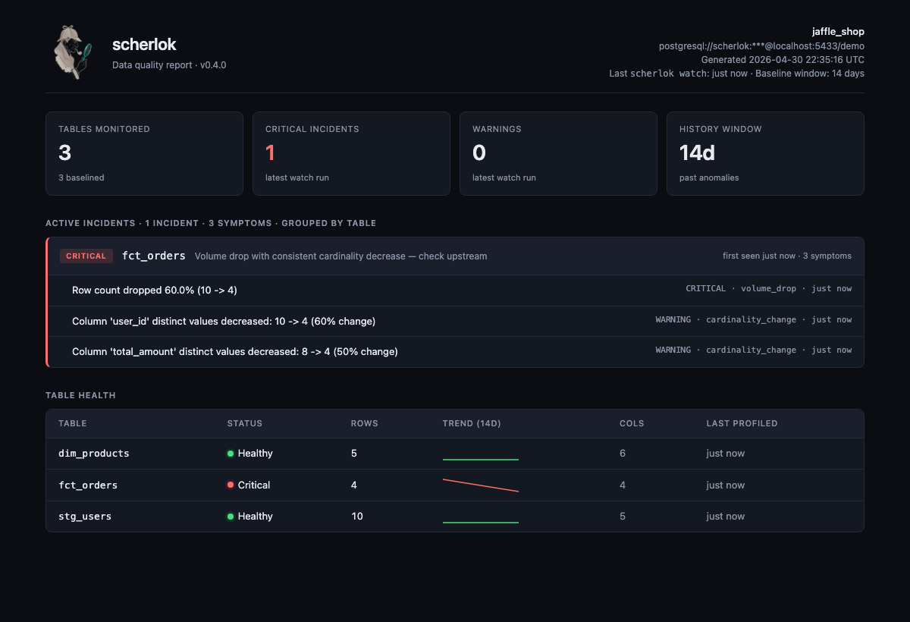

# Dashboard

The `scherlok dashboard` command turns the local profile store into a single-file HTML report.



## Quick start

```bash
scherlok dashboard --out report.html
```

The output is a self-contained HTML file (~28 KB): no external CSS, no fonts to download, logo embedded as base64. Open it in any browser.

## Options

| Flag | Default | Description |
|---|---|---|
| `--out` / `-o` | `scherlok-report.html` | Output path |
| `--days` / `-d` | `14` | History window for the "Recent anomalies" section |
| `--theme` | `auto` | `auto` (follows OS), `dark`, or `light` |
| `--project-name` | derived | Override the header label |

## What the report shows

- **Header KPIs** — tables monitored, critical / warning incident counts, history window
- **dbt context** — only when the report is generated after a `scherlok dbt` run (omitted otherwise)
- **Active incidents** — grouped by table. One card per table with all related symptoms, threshold info, and `first seen / last seen` timestamps
- **Schema drift** — rendered git-diff style: `+` added, `−` removed, `~` type changed, with old → new types
- **Table health** — one row per profiled table with status dot, row count, inline sparkline, last profiled, column count
- **Recent anomaly history** — full `--days` window with per-anomaly timestamps

## How it composes

```
ProfileStore
    │
    ├── get_anomaly_history(days)   ─┐
    └── get_latest_profile(table,*)  │
                                     ▼
                          assembler.assemble_view()
                                     │
                                     ▼
                          grouping.group_anomalies()
                                     │
                                     ▼  (renders Symptoms with detected_at,
                                        Incidents with first_seen/last_seen)
                                     ▼
                          schema_parser.parse_schema_anomaly()
                                     │
                                     ▼  (collapses 3 schema-drift anomalies
                                        for the same table into 1 Symptom
                                        with a SchemaDiffEntry list)
                                     ▼
                                template.html
                                  + styles.css (embedded)
                                  + logo (base64 embedded)
                                     │
                                     ▼
                                report.html
```

## Out of scope

The dashboard is intentionally read-only. Anything that requires state, identity, real-time updates, or cross-tenant aggregation is out of scope:

- Acknowledge / suppress / resolve workflow
- Multi-project / multi-DB single pane of glass
- Scheduled hosted runs
- ML-based seasonality detection
- Lineage from query logs
- SSO / RBAC / audit log
- Bidirectional Slack ack flow

## Contract with the detectors

The dashboard is read-only and parser-driven. It does **not** mutate the SQLite schema or anomaly contract. Schema-drift rendering uses regex parsers ([`schema_parser.py`](schema_parser.py)) against the existing `detect_schema_drift` message format. If the message format ever changes, the parser tests will fail loudly.
